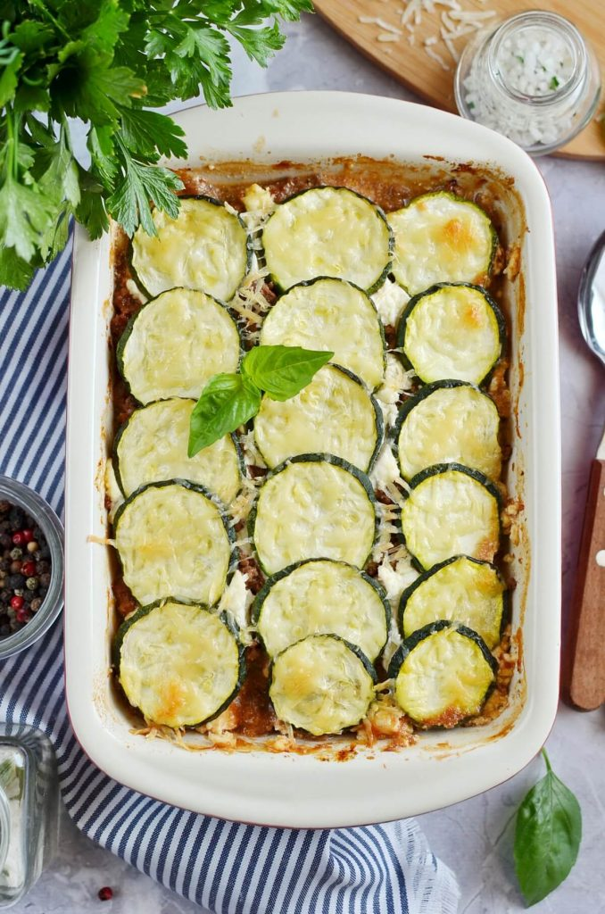

## HEALTHY Brazilian-Moussaka

This Greek Zucchini Moussaka is a recipe that will perfectly suit a healthy meal plan and particularly follows the rules of low carbs.

Layers of zucchini slices and a ground beef, tomato sauce and onion mix stuffed between ricotta cheese. I use authentic garlic cloves, oregano, cinnamon, bay leaves and ground cloves to add flavor to this delicious Greek delicacy.

